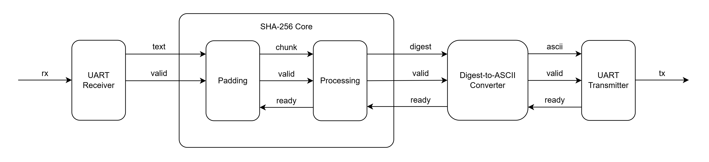

# SHA-256 Hardware Core

A hardware implementation of the SHA-256 cryptographic hash algorithm written in 
SystemVerilog and designed for FPGA deployment. The system communicates with a host 
computer over UART, allowing input messages to be transmitted to the FPGA and the 
resulting 256-bit SHA-256 digest to be returned as a hexadecimal ASCII string.

## System Architecture

### Block Diagram

### Module Overview 

| Module                    | Description |
| ---                       | --- |
| UART Receiver             | Deserializes message bytes from the host computer and passes them into the hashing logic |
| Padding                   | Buffers incoming bytes and creates a 512-bit message chunk consisting of the message bytes, followed by a '1', zero-padding and the 64-bit message length |
| Processing                | Implements the core cryptographic digest algorithm, consisting of 64-word message scheduling, working variable initialization, and a 64-iteration compression loop |
| Digest-to-ASCII Converter | Converts the 256-bit digest to hexadecimal ASCII characters, followed by a carriage return and newline  |
| UART Transmitter          | Serializes and transmits the resulting ASCII characters |
